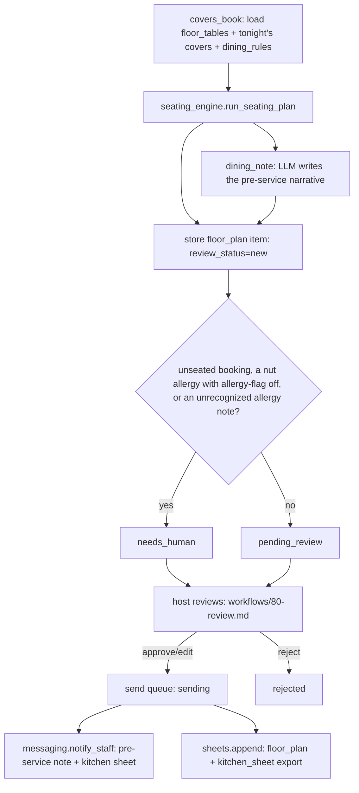

# Table / Floor Management AI — "The Maître d'"

Optimises the restaurant floor (seating plan, covers pacing, turn times, no-show prediction, walk-in vs reservation balance) and syncs with concierge bookings.

## What it does

Optimises the restaurant floor (seating plan, covers pacing, turn times, no-show prediction, walk-in vs reservation balance) and syncs with concierge bookings.

## What it won't do

Won't override a human host's on-the-night judgement.

## Why it matters

Better table turns and fewer gaps = more covers from the same room.

## What to expect

5–15% more covers per service via tighter turns and no-show backfill.

The roster text above is quoted exactly as it appears on the demo
platform's agent menu — this repo does not promise more than that, and does
not promise less. ROI figure: `+10%` covers per service (revenue). Two
things the roster promises that this repo does not yet implement — no-show
*prediction* (the walk-in backfill is real; the prediction is not) and a
true per-table turn-time model (there is one fixed early/late cutoff) — are
named plainly in `docs/benefits.md` and `docs/how-it-works.md`, not hidden.

## Who it's for

Any restaurant, hotel dining room, or private-dining operation that still
builds its seating chart by hand, or in a spreadsheet, before every service
— and wants that chart built in seconds with its reasoning written down,
not a black box.

You will get the most from this repo if:

- You can export (or hand-key) your table geometry and tonight's
  reservations as CSV — there is no PMS integration to wait for; the
  `csv` path works from day one.
- You run group bookings or private-dining events that need more than one
  table joined together, and want that math done consistently instead of
  guessed at under pressure.
- You want a written reason for every unseated booking and every allergy
  flag, not just a chart with gaps.
- You are comfortable a host reviews every plan before it reaches the
  floor — this ships in shadow mode and stays there until you say
  otherwise, and the plan itself never becomes fully automatic even in
  live mode (see "Guardrails & safety").

It is less of a fit if your floor has fewer than about six tables (the
private-dining composite and the turn split have little to optimise at that
scale) or if your reservation book lives somewhere you cannot export from at
all, even by hand — this agent needs somewhere to read tonight's book from.

## How it works

One deterministic seating engine plus one cosmetic model call — no
randomness, no model call anywhere near a table assignment.



`tools/seating_engine.py` is the whole decision engine and has no I/O in it:
plain dataclasses in, a seating plan and a step-by-step reasoning log out.
`tools/run.py` is the only place that talks to the store and the LLM. The
**only** model call in this agent's main loop writes a short pre-service
note about a plan that already finished (`prompts/dining_note.md`) — it
cannot move a table. Full detail, the exact placement rules, and the seven
design decisions taken where the source this repo was built from left a
gap: `docs/how-it-works.md`.

### The two modes

| Mode | What happens |
|---|---|
| `shadow` (default) | Reads the book, plans, and queues. **Never** notifies staff or exports a sheet — including a plan you already approved; the approval is recorded, sending waits for `mode: live`. |
| `live` | Plans that are approved actually notify the floor and export. Everything else still waits. |

### The review loop

Nothing reaches the floor without a person saying so. `workflows/80-review.md`
covers the full loop: list, show, approve, edit, reject, send.

### What runs when

| Workflow | Cadence | Provider used |
|---|---|---|
| `workflows/10-seating.md` (`tools/run.py --service lunch`) | daily, `07:00` | whatever `llm.provider` is set to (narration only) |
| `workflows/10-seating.md` (`tools/run.py --service dinner`) | daily, `16:00` | narration only |
| `workflows/80-review.md` (`tools/review.py`) | whenever a host is available | none — queue operations only |

`python3 tools/schedule.py --all` prints one ready-to-paste cron/launchd/
systemd snippet per entry above, read straight from `config/agent.yaml:
schedule:` — see "Run it" below.

## What you need

| Item | Required? | Notes |
|---|---|---|
| A computer or small server that can run Python 3.11+ | Yes | Your laptop is fine to start; `workflows/90-go-live.md` covers scheduling it properly. |
| A Claude Code subscription, or your own Anthropic API key | Yes | The `interactive` provider uses the Claude Code session you already have open — zero extra cost, and the model only ever writes a pre-service note. |
| Your table geometry and reservation book, as CSV (or hand-keyed) | Yes | Starts on the bundled fixtures; `data/imports/floor_tables.csv` + `data/imports/covers.csv` work with any reservation system. |
| A WhatsApp number, a webhook URL, or nothing at all | Optional | Without one, `notify_staff` has nowhere to send — the plan still queues and exports to CSV either way. |
| A Google Sheet, or nothing at all | Optional | The kitchen sheet and floor-plan log export to local CSV by default; a Sheet is a nicer place for the kitchen to read them. |

Time estimate: 5 minutes to see the demo, half a day to connect your real
floor and book and fill in the dining-rule constants for your room, a few
real services of watching the review queue before you would reasonably
consider going live.

## Quick start (5 minutes, no credentials)

```bash
git clone https://github.com/th1-ai/table-floor-management-ai.git table-floor-management-ai
cd table-floor-management-ai
make setup
make demo
```

You should see something like this:

```
Table / Floor Management AI demo - The Birchwood Room, fixtures/restaurant + fixtures/inbound

Plan tonight's seating (day_offset=1, dinner):

  - Reading the book — 9 booking(s), 71 cover(s) at dinner.
  - Turn-time pacing is on: bookings before 20:15 are the first turn, 20:15 and later are the second — 32 sittings across 16 tables.
  - 1 occasion booking(s) held a window or terrace table.
  - NUT ALLERGY at Bianchi, Okafor's table — kitchen sheet flagged, allergen brief goes to the pass, the section server and the sommelier before service.
  - 2 seated part(y/ies) carry a dietary note.
  - Checked every zone against the 24-cover cap per turn.
  - 9 of 9 parties seated (71 covers), 10/16 tables used, 1 warning(s).

Note: Tonight splits across two turns with the room close to full both times. Larkspur Media's party of 40 takes the private dining composite off tables P1, P2, M5, M4 and T3 under the set-menu capacity bonus. Okafor and Bianchi both carry a nut allergy, so the kitchen sheet is flagged and the allergen brief goes to the pass, the section server and the sommelier before service. Every booking tonight is seated, with no section over the server-balance cap.

[info ] queued item_id=<id> status=pending_review seated=9 unseated=0

Simulate a walk-in six-top (tools/run.py --walk-in "Six-top,6,20:15"):

  - Reading the book — 10 booking(s), 77 cover(s) at dinner.
  ...
  - 10 of 10 parties seated (77 covers), 10/16 tables used, 1 warning(s).

Contrast: turn 'Allow table joins' off and re-plan (tools/run.py --set-rule join-tables=off):

  - Reading the book — 10 booking(s), 77 cover(s) at dinner.
  ...
  - Larkspur Media (party of 40) could not be seated: Table joins are off: the private room's largest single table (P1, 10 seats) is smaller than the party of 40.
  - 9 of 10 parties seated (77 covers), 8/16 tables used, 0 warning(s).

3 plan(s) waiting for a host to review - a floor plan always does, see docs/safety.md.
Nothing was sent: mode is shadow, and demo never calls notify_staff() or sheets.append() on anything.
Next: `make review` to see what is waiting, or read workflows/10-seating.md.

DEMO OK — 3 items processed, 3 drafted, 0 sent (shadow)
```

(`item_id` is a random id, different every run — everything else repeats
identically, because the engine is pure.) Every number above comes from an
invented restaurant, "The Birchwood Room," with 16 tables and 11 fabricated
bookings — including a 40-guest corporate group that needs the
private-dining composite and two other bookings with a nut allergy —
designed to exercise the interesting paths in one run, so you can see
exactly how this agent thinks before it ever touches your real floor. Next:
open `claude` in this folder and follow "Set up with Claude Code" below.

Then `make doctor` — expect one `FAIL` (`hotel identity`, because the
property is still the shipped placeholder "Hotel Aurora") and a couple of
`warn` lines. That is the intended state of a fresh clone; see
`workflows/00-setup.md` for filling in the real property and floor.

## Set up with Claude Code

Open `claude` in this folder. Paste each prompt below in order — Claude will
follow the named workflow file, which tells it exactly which tools to run
and what to check.

**Phase 1 — first run.**

> Read `workflows/00-setup.md` and walk me through it. I have not run this
> agent before.

**Phase 2 — plan a real service.**

> Read `workflows/10-seating.md`. Plan tonight's dinner and show me the plan
> in plain language — who's seated where, any warnings, anything unseated.

**Phase 3 — the review queue.**

> Read `workflows/80-review.md`. Show me what is waiting for me, one at a
> time, and act on my decisions.

**Phase 4 — going live.**

> Read `workflows/90-go-live.md`. Go through the checklist with me honestly
> — do not recommend going live until it is genuinely true.

You can also just run the agent directly — `/table-floor-management-ai` in
this folder runs the main loop and works the queue in one command; see
`.claude/skills/table-floor-management-ai/SKILL.md`.

## Connect your systems

Full detail, including the "implement your own" recipe, is in
`docs/integrations.md`. This agent uses only two of the four shared
adapters — **Messaging** and **Sheets** — plus its own CSV-based floor book
that no adapter family in this repo family covers (see "Design decisions"
#6 in `docs/how-it-works.md`).

### The floor book — not a shared adapter

| Source | Status | Needs |
|---|---|---|
| `fixtures/restaurant/floor_tables.json` + `fixtures/inbound/*.json` | universal | nothing — what `make demo` uses |
| `data/imports/floor_tables.csv` + `data/imports/covers.csv` | universal | CSV exports — **start here for a real property** |

`tools/covers_book.py` reads whichever is present (CSV wins), then caches
it in this agent's own `data/agent.db` tables. A walk-in or a rule toggle
changes that copy directly; re-importing the CSV never overwrites a row
already there. Exact headers: `docs/integrations.md`.

### Messaging - `systems.messaging.adapter` in `config/hotel.yaml`

| Adapter | Status | Needs |
|---|---|---|
| `mock` | universal | nothing — no-op, what `make demo` uses |
| `unipile` | built | `UNIPILE_DSN`, `UNIPILE_API_KEY`, `UNIPILE_ACCOUNT_ID`, `UNIPILE_STAFF_CHAT_ID` |
| `webhook` | universal | `MESSAGING_WEBHOOK_URL` — POST to Zapier, Make, n8n, or your own endpoint |

Used for exactly one write: `notify_staff()`, the pre-service note and the
seated/warning summary, once a plan is approved and sent.

### Sheets - `systems.sheets.adapter` in `config/hotel.yaml`

| Adapter | Status | Needs |
|---|---|---|
| `csv` | universal | nothing — writes `data/exports/kitchen_sheet.csv` + `data/exports/floor_plans.csv` |
| `google` | built | `GOOGLE_SHEET_ID`, `GOOGLE_SERVICE_ACCOUNT_FILE` — a live shared spreadsheet |

### PMS and Email - shipped, unused by this agent

Every repo in this family shares the same `core/adapters` registry, so
`make doctor` always pings a PMS and an email adapter even when an agent has
no use for one — `fixtures/hotel/reservations.json` ships as an empty array
purely so that line reads PASS instead of a misleading FAIL. Nothing in
this repo calls `core.adapters.get_pms()` or `core.adapters.get_email()`.

Check what is actually working on your machine at any time:

```bash
make doctor
```

## Run it

```bash
make run                                         # plan tomorrow's dinner (the defaults)
make run ARGS="--day-offset 0 --service lunch"   # today's lunch
make run ARGS="--dry-run"                        # compute the plan, write nothing
make watch                                       # keep planning on the configured interval
make run ARGS='--walk-in "Six-top,6,20:15"'      # simulate a walk-in, then re-plan
make run ARGS="--set-rule join-tables=off"       # toggle a dining rule, then exit
make review                                      # what is waiting for a host
make report                                      # what the agent did, and what it cost
```

**Scheduling.** Every recurring job lives in `config/agent.yaml: schedule:`
with its own `command:` and `cadence:` — `plan_lunch` (07:00 daily),
`plan_dinner` (16:00 daily):

```bash
python3 tools/schedule.py --all
```

prints one ready-to-paste cron/launchd/systemd snippet per job, read
straight from that block. `scheduler/crontab.example`,
`scheduler/launchd.example.plist`, `scheduler/systemd.example.service` and
`scheduler/systemd.example.timer` have the generic single-job form if you
would rather hand-edit.

**Subscription or API.** `llm.provider: interactive` or `claude-code` runs
on the Claude Code subscription you already pay for — genuinely the
cheapest way to run this agent, with the caveat that Anthropic's usage
policy governs automated use of a personal subscription (a couple of
scheduled runs a day is normal; hammering it around the clock is not).
`llm.provider: anthropic` uses your own API key, bills per token, and is
the right choice if you run many services a day. Either way the model only
ever writes a pre-service note — `make report` shows what you are actually
spending, and it should stay small. See `docs/safety.md` for the full
honest note.

## Go live

Shadow mode is the default and stays the default until you change it. The
full checklist — real property and floor filled in, a real CSV book
connected, a few real services of review behind you, the shadow backlog
cleared — is in `workflows/90-go-live.md`. In short:

```yaml
# config/hotel.yaml
mode: live
```

Going live means an **approved** plan now actually notifies the floor and
exports — it does not change what needs approval, and it never turns the
seating plan itself automatic (see "Guardrails & safety"). `review.
require_approval_for` still lists `send_message` and `sheets_write` by
default, so every plan still waits for a host. Before flipping the switch,
clear the backlog that built up in shadow mode — it was computed against an
earlier book:

```bash
python3 tools/review.py stale
```

Going back to shadow (`mode: shadow`, or `AGENT_MODE=shadow` in `.env` for
one run) stops every send immediately, mid-schedule, with no other change
required.

## Guardrails & safety

Full detail in `docs/safety.md`. The short version:

**What it will not do.**

- Override a human host's on-the-night judgement — the roster's own
  promise. The engine only ever proposes; nothing here auto-seats a
  walk-in, auto-toggles a rule, or notifies staff without a host approving
  first, in `mode: live` and `mode: shadow` alike.
- Notify staff or export a sheet while `mode: shadow` — including a plan
  you already approved.
- Drop a booking silently. Every unseated booking carries a specific
  reason.
- Hide a nut allergy, whatever language it was written in — English,
  Spanish, French, German, Italian and Portuguese phrases are all
  recognized, accent-folded. If `allergy-flag` is off, the risk is still
  named in a warning rather than simply vanishing from the plan.
- Take a payment, issue a refund, or move money — payment adapters are
  read-only by design and this agent never calls one.

**What always needs a human**, enforced in code
(the `_needs_human` check in `tools/run.py`), not just in the prompt:

- A booking that could not be seated at all.
- A nut allergy present in the book while `allergy-flag` is off.
- A dietary note that names some allergy but does not match a recognized
  phrase — never guessed at, always escalated.

**No guest-facing text, so no AI-disclosure line.** Unlike a
guest-messaging agent in this family, this repo produces nothing a guest
ever reads — the pre-service note goes to your own floor and kitchen team.
The EU AI Act Article 50 guest-disclosure pattern the rest of this family
follows does not apply here. See `docs/safety.md`.

**Data handling.** Everything lives in `data/agent.db` on your own machine
— there is no cloud service behind this repo. The sensitive data here is
dietary and allergy notes, not payment cards; keep `data/agent.db` off a
shared machine and set `privacy.retention_days` to something short.

## Customising

**`config/agent.yaml`.** The restaurant's name (`restaurant:`), which
services to plan by default, the house constants (`late_cutoff`,
`banquet_factor`, `zone_cover_cap`), the five `dining_rules`' seed state,
`review.require_approval_for`, and `schedule:`.

**Toggling a rule day to day.** Edit the config to change the *seed* state
for a fresh database; to change the *live* state, use
`tools/run.py --set-rule <key>=on|off` — see `workflows/10-seating.md`.

**`knowledge/dining-policy.md`.** Not read by any prompt — a plain-language
record of why your constants are set where they are, for the next person
who inherits this floor. See `knowledge/README.md`.

**`prompts/dining_note.md`** is plain markdown with `{{var}}` placeholders
— edit it to change the pre-service note's tone. It cannot change a table
assignment; only the words about a plan that already happened.

**Adding a language.** There is nothing to add — this agent produces no
guest-facing or staff-facing free text beyond the (optional) pre-service
note, which is always written in the language you write the prompt in.

**Changing the floor.** Edit `data/imports/floor_tables.csv` (or the
fixture, while testing) and re-run `make doctor` to confirm the new table
count.

## Troubleshooting & FAQ

Full list: `workflows/99-troubleshooting.md`. The most common ones:

**`make run` exits with code 3.** Not an error —
`llm.provider: interactive` parked the pre-service-note prompt. Answer it in
`data/pending/` and re-run; the plan itself is not recomputed, only the
note.

**A booking always shows up unseated.** `python3 tools/review.py show <id>`
names the exact reason — no table (or combination) of the right size, or
`join-tables` is off and the private room's largest single table is still
too small.

**"Why didn't my walk-in show up in the plan I already approved?"** It
doesn't — a walk-in (or a rule toggle) always plans the whole service again
from scratch, as a fresh item. The plan you approved is untouched; approve
or reject the new one separately. See `docs/how-it-works.md`
"Idempotency".

**"Can the plan itself become automatic?"** Not in this template, by
design — see "Guardrails & safety" above. `mode: live` changes whether an
*approved* plan sends; it never removes the review step.

## Measuring the benefit

```bash
make report
```

Tracks parties seated vs. planned, tables used per service, warnings
raised, unseated bookings, and LLM spend (one call per plan). Full detail,
what each number means, and the honest gaps between the roster promise and
what this repo actually measures (no-show prediction, per-table turn
times): `docs/benefits.md`.

## About

Built by [TH1](https://th1.ai) as part of a family of open-source hotel
AI-agent templates. Licence: MIT (`LICENSE`). Want it run for you, tuned to
your own floor, instead of running it yourself? [th1.ai](https://th1.ai).

**Changelog.** v1 — initial release: the deterministic seating engine
(turn pacing, occasion holds, group placement, the private-dining
composite, server-balance, the kitchen allergy sheet), the walk-in and
rule-toggle actions, the review queue, and the pre-service note.
