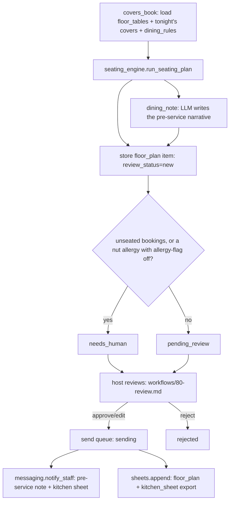

# How it works

## One deterministic engine, one cosmetic LLM call

`tools/seating_engine.py` is a pure function: floor tables + tonight's book +
the five dining rules go in, a seating plan comes out. No randomness, no
clock, no I/O. Feed it the same three inputs twice and you get the same plan
twice — every number in the plan traces back to a row you gave it. This
mirrors the source engine this repo was built from, which states the same
rule in its own header comment.

The **only** model call in the whole loop writes a three-to-four sentence
pre-service note summarising a plan that already exists
(`prompts/dining_note.md`). It cannot move a party, seat a table, or change a
warning. If the model is unavailable or refuses, the plan is unaffected — the
note is just missing (see "Narration never blocks the plan" below).

## What runs when

| Workflow | Trigger | Cadence | Provider |
|---|---|---|---|
| Plan tonight's seating (`workflows/10-seating.md`) | scheduled, or on demand before a service | twice daily (`schedule: plan_dinner`, `plan_lunch`) — see `config/agent.yaml: schedule:` | `llm.provider` (narrative only) |
| Walk-in re-seat | a host takes a walk-in (`tools/run.py --once --walk-in`) | on demand | same |
| Rule toggle | a host wants a different trade-off (`tools/run.py --set-rule`) | on demand | none (no LLM call) |
| Review the queue (`workflows/80-review.md`) | after every plan | continuous | none |
| `make report` | whenever | on demand | none |

`make schedule ARGS="--all"` prints one snippet per job listed under
`config/agent.yaml: schedule:` — see README section 9 for its exact output.

## The loop, step by step

1. **`covers_book.ensure_seeded`** loads `floor_tables`, `restaurant_covers`
   and `dining_rules` into this agent's own SQLite tables on *every* call —
   from `data/imports/*.csv` for a real property, falling back to
   `fixtures/restaurant/*.json` + `fixtures/inbound/*.json` only while no CSV
   exists yet, or pinned to those same fixtures whenever `demo=True`
   (`tools/demo.py`, on its own database, never `data/imports/`). This is a
   covering-window replace, not a one-time seed: `floor_tables` and the
   imported slice of `restaurant_covers` are dropped and reloaded from the
   live source every call, so an edited CSV row shows up on the very next
   `make run` / `make doctor`. `dining_rules` is the one exception — it still
   only seeds once, because it is a host's own live toggle state
   (`tools/run.py --set-rule`), not an import. A walk-in
   (`tools/run.py --walk-in`) inserts a real `source='walk_in'` row directly;
   that row is never part of the covering-window replace, so re-importing a
   CSV can never lose it.
2. **`seating_engine.run_seating_plan(tables, covers, rules)`** does the
   whole job in twelve deterministic steps: read the book, split into turns
   (`turn-time`), sort each turn's queue big-first with occasion holds
   jumping ahead (`vip-window`), place groups (single table → joined pair →
   private-dining composite with the 1.15x set-menu bonus), place ordinary
   parties, flag every dietary note onto a kitchen sheet with any nut
   allergy headlined (`allergy-flag`), check server-section load against the
   24-cover cap (`server-balance`), and build the summary. Full rule detail
   is in the module's own docstring, which is the more precise reference —
   this page stays at the level of *why*, that module stays at the level of
   *exactly how*.
3. **`tools/run.py`** stores the result as one `items` row
   (`kind="floor_plan"`), attempts the narrative, and queues it for a host.
   It never publishes anything itself — see "Nothing seats a walk-in or
   changes a plan without a person" below.

## Idempotency

**The book.** Importing the same CSV twice never duplicates rows — every
call to `covers_book.ensure_seeded` replaces the imported/seeded rows
outright (`_reimport_tables` / `_reimport_covers`, both `DELETE` + `INSERT
OR REPLACE`, keyed on the CSV's own `id` column) rather than accumulating.
`restaurant_covers.source='walk_in'` rows are excluded from that delete, so
a live walk-in survives every re-import untouched.

**The plan.** A `floor_plan` item's `external_id` is
`<day_offset>-<service>-<book_fingerprint>`, where `book_fingerprint` is a
short hash of every table, every relevant cover, and every rule's enabled
state (`covers_book.book_fingerprint`). Re-running the exact same command
against the exact same book finds the *same* item and resumes it rather than
creating a new one — that is what makes the `interactive` provider's
retry-after-pending work (see "Resumable stages" below). The moment a walk-in
is inserted or a rule is toggled, the fingerprint changes, a new item is
created, and the old plan is left in the database untouched — a genuine
fresh re-run, never a silent mutation of what a host already saw. This is
also why "Reset demo state" in the source demo and `make demo`'s own
clean-slate behaviour here (`tools/demo.py` deletes its own database on every
run) both make sense: a plan is a append-only history, not a single row you
overwrite.

**Sequence counters.** None are needed here — there is no invoice or
confirmation number series in this agent.

## Resumable stages

With `llm.provider: interactive`, `run_seating_plan` always finishes (it has
no model call in it), but the narrative step can still pend. The plan is
written to the item's payload under `_plan` *before* the narrative is
attempted, and `_plan` is an underscore-prefixed key, so `upsert_item`'s
payload refresh preserves it across the retry
(`core/store.py:upsert_item`). On re-run, `tools/run.py` checks `item.payload
.get("_plan")` — if it is already there, the engine is not run a second time;
only the narrative is retried. This is the same trap and the same fix
`front-desk-ai` and the reference agent document: a later LLM call pending
after an earlier stage already finished must resume at the pending stage, not
restart from the top or get silently skipped. `tests/test_seating_run.py::
test_retry_after_interactive_pending_resumes_narrative_only` is the
regression test.

## Nothing seats a walk-in or changes a plan without a person

The roster promise is explicit: *"Won't override a human host's on-the-night
judgement."* Concretely:

- The engine only ever **proposes**. Every `floor_plan` item lands at
  `pending_review` or `needs_human` — never `auto_sent` — regardless of
  `mode` or `autonomy` settings, because there is no autonomy setting for
  this action. `needs_human` fires when a booking could not be seated at all,
  or when a nut allergy exists in tonight's book while `allergy-flag` is off
  (the risk must reach a person even though nothing prints on the kitchen
  sheet).
- "Simulate a walk-in" and "toggle a rule" both **recompute the whole plan**;
  neither mutates a table's existing assignment behind a host's back.
- The only outbound actions — `messaging.notify_staff` (the pre-service note
  and kitchen sheet, to the floor/kitchen team) and `sheets.append` (the
  exported floor plan + kitchen sheet) — are both `@guarded_write` and both
  wait for `tools/review.py approve` before `tools/review.py send` will touch
  them. `mode: shadow` blocks both regardless of approval, exactly like
  every other agent in this family.

## Narration never blocks the plan

The source this repo was built from puts a rate limiter in front of its
narrative endpoint and always returns HTTP 200, degrading to `{note: null}`
rather than blocking the plan. This repo's equivalent: the narrative call is
wrapped so that any `LLMError` (budget exhausted, refusal, schema mismatch,
provider unavailable) is caught, logged as a warning, and the item is queued
with `narrative: null` — the plan itself, the kitchen sheet and every warning
are already safely stored by that point. `LLMPendingInteractive` is
deliberately **not** caught here (it is not an `LLMError` — see
`core/llm.py`): it must propagate to `tools/run.py`, which exits 3 and tells
the hotel's Claude session to answer it, exactly as every other agent in this
family does. A broad `except Exception` around the narrative call would
silently eat that pause, which is the mistake `ARCHITECTURE.md` and
`factory/workflows/build-repo.md` both call out by name.

## Design decisions (where the spec was silent)

The spec this repo was built from (`specs/table-floor-management-ai.md`)
flags five open questions in its own section 11. Decisions taken here:

1. **No-show prediction.** The roster promises it; the source engine has no
   scoring function for it at all — every booking is treated as certain to
   arrive. This repo does not invent one either: `docs/benefits.md` says so
   plainly, and the honest scope of "no-show prediction" here is exactly
   what the source has: none. A hotel that wants this needs to say so, and
   it is a real gap, not a hidden one.
2. **Syncs with concierge bookings.** Not demonstrated in the source. This
   repo's covers book accepts a `source` field per booking (`seed`, `walk_in`,
   `concierge`, `import`); a booking tagged `concierge` is treated exactly
   like any other, which is the honest version of "syncing" available
   without a real concierge-system integration to port. See
   `docs/integrations.md`.
3. **Turn length.** The source has one fixed cutoff (`LATE_CUTOFF = "20:15"`)
   splitting the night into two turns, not a true per-table turn-time model.
   This repo ports exactly that — `config/agent.yaml: late_cutoff` — and says
   so in the README rather than promising a variable turn-time model that
   does not exist yet.
4. **The 90-minute turn duration.** Asserted only in a comment in the source,
   never enforced by a constant. Not ported as a number; the two-turn split
   is the only turn-length behaviour this repo has.
5. **The banquet bonus (1.15x) and the server-balance cap (24 covers).**
   Both are house constants with no cited benchmark in the source. Ported as
   configurable defaults (`config/agent.yaml: banquet_factor`,
   `zone_cover_cap`) with a comment flagging them as a starting point to
   calibrate against the property's own numbers, not an industry standard.

**Two more decisions this repo had to make on its own**, because the spec
describes a demo UI this repo does not have:

6. **The restaurant's own covers book is not the room PMS.** `floor_tables`
   and `restaurant_covers` do not fit `core/adapters/base.py`'s `Reservation`
   dataclass (room type, check-in/out, adults/children) — a restaurant cover
   has a time, a party size and a dietary list, not a room. Rather than force
   a bad fit onto the shared `PMS` interface, this agent reads its own
   covers book directly: `fixtures/restaurant/*.json` for the demo, or
   `data/imports/floor_tables.csv` / `data/imports/covers.csv` for a real
   property (`tools/covers_book.py`, documented in `docs/integrations.md`
   as its own "universal: CSV import", in the same spirit as
   `core/adapters/pms_csv.py` but for a table book instead of a room book).
   This agent therefore does not use `systems.pms.adapter` at all — `make
   doctor` still pings it (every repo in the family shares the same
   `core/adapters` registry) but nothing here reads or writes through it.
7. **Rule toggles and the walk-in are CLI actions, not UI clicks.** There is
   no floor-plan UI in this repo. `tools/run.py --set-rule <key>=on|off` and
   `tools/run.py --once --walk-in "<name>:<size>:<HH:MM>"` are the
   equivalents a host's Claude Code session runs on their behalf — both are
   covered as commands in `workflows/10-seating.md`.
